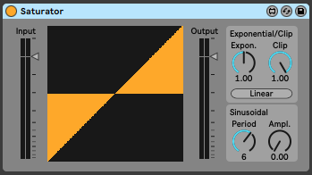

# Saturator

A wave-shaping device made with [Max for Live](https://www.ableton.com/en/live/max-for-live/). Use the clip, exponential, and sinusoidal parameters to design a transfer function, or draw one in with your mouse.



## Installation

1. Open Live. In browser sidebar, right click "User Library" -> "Show in Finder" (Mac) or "Show in Explorer" (Windows)
2. Follow the path and place file:
```
Library/Presets/Audio Effects/Max Audio Effect/Saturator.amxd
```
